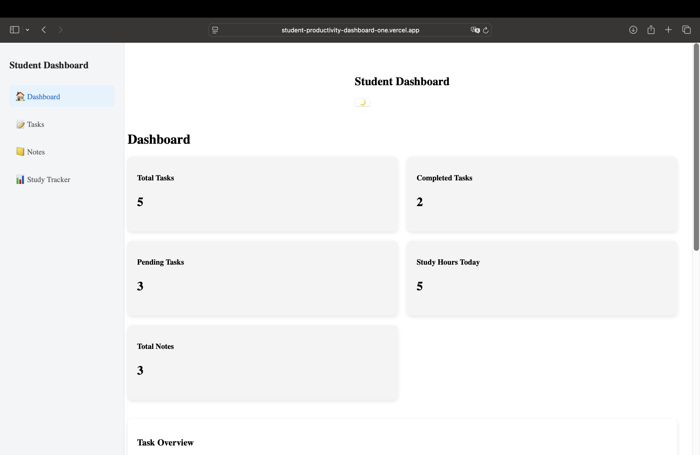
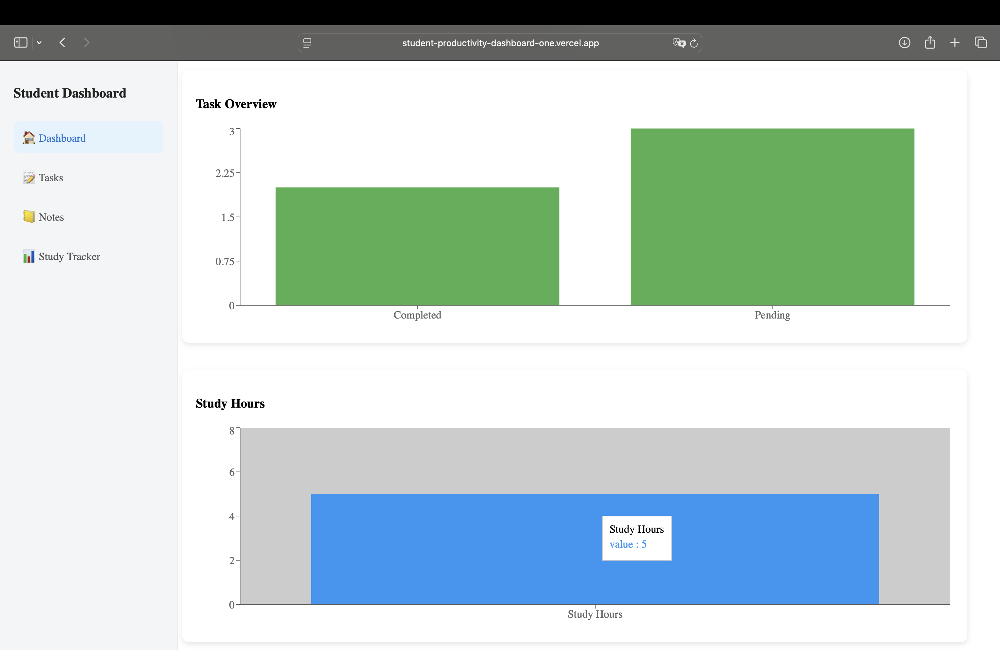
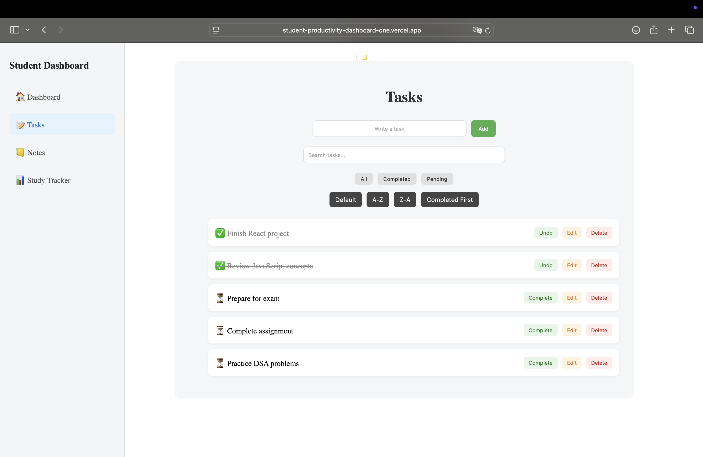
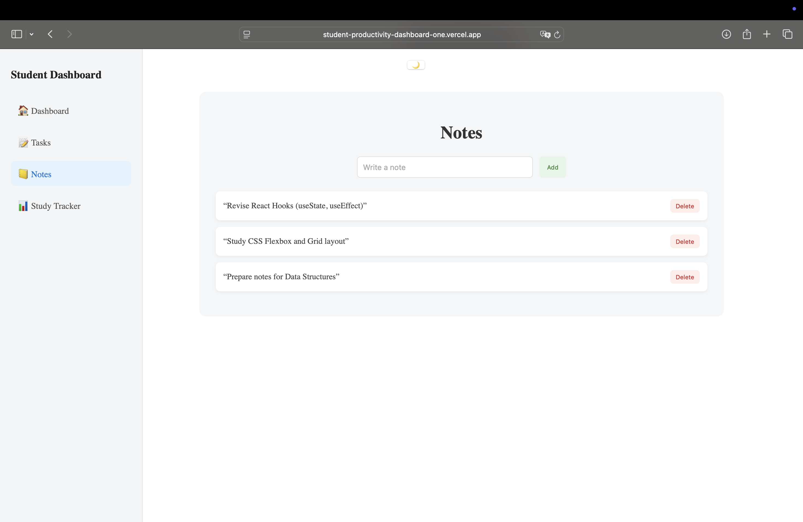

# 🎓 Student Productivity Dashboard

A React-based web application to manage tasks, notes, and study hours in one place.

---

## 🚀 Live Demo

👉 [View Live App](https://student-productivity-dashboard-one.vercel.app)

---

## 📌 Features

- ✅ Task Management (Add, Edit, Delete, Complete)
- 📝 Notes Section
- ⏱️ Study Tracker (with local storage)
- 📊 Dashboard with Charts (Recharts)
- 🌙 Dark Mode
- 🔍 Search, Filter, and Sort Tasks

---

## 🛠️ Tech Stack

- React.js
- CSS
- Recharts
- LocalStorage
- React Router
- Vercel (Deployment)

---

## 📸 Screenshots

### 📊 Dashboard

### 📊 Charts

### ✅ Tasks Page

### ⏱️ Study Tracker

### 📝 Notes

---

## 📂 Project Structure

src/
│
├── components/
│   ├── Sidebar.jsx
│   └── Navbar.jsx
│
├── pages/
│   ├── Dashboard.jsx
│   ├── Tasks.jsx
│   ├── StudyTracker.jsx
│   └── Notes.jsx
│
├── styles/
│   ├── App.css
│   ├── Dashboard.css
│   ├── Tasks.css
│   ├── StudyTracker.css
│   ├── Notes.css
│   └── Sidebar.css
│
├── hooks/
│   └── useLocalStorage.jsx
│
├── App.jsx
└── index.js

---

## ⚙️ Installation

git clone https://github.com/celestamaria-cmv/student-productivity-dashboard.git  
cd student-productivity-dashboard  
npm install  
npm start  

---

## ⚙️ How It Works

- Tasks, notes, and study hours are stored using LocalStorage  
- Dashboard dynamically calculates total, completed, and pending tasks  
- Charts are generated using Recharts  
- Study tracker updates hours in real time  
- Dark mode is managed globally using React state  

---

## 📊 Key Learnings

- Built reusable components using React  
- Managed state using React Hooks  
- Implemented LocalStorage for data persistence  
- Integrated charts using Recharts  
- Structured a scalable frontend architecture  
- Deployed a production-ready application on Vercel  

---

## 🔮 Future Improvements

- Add authentication (Login/Signup)  
- Connect to backend (Firebase/MongoDB)  
- Improve mobile responsiveness  
- Enhance UI with modern design  

---

## 👩‍💻 Author

Celesta Maria Varghese  
https://github.com/celestamaria-cmv  

---

## ⭐ Show your support

If you like this project, feel free to ⭐ the repository!